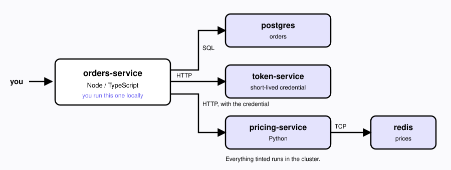

# Orders Demo App

A small orders service backed by Postgres, with prices served by a separate
pricing service. Built to try [mirrord](https://metalbear.co/mirrord) against a
running cluster.

## Architecture



- **orders-service** — looks orders up in Postgres, and totals a customer's open
  orders by asking pricing-service for each SKU's unit price. This is the one
  you run locally under mirrord.
- **token-service** — issues the short-lived credential orders-service needs
  before it can call pricing-service.
- **pricing-service** — returns a unit price for a SKU from Redis.

## Endpoints

| Method | Path | What it does |
|---|---|---|
| `GET` | `/orders/:id` | One order, straight from Postgres |
| `GET` | `/customers/:id/summary` | A customer's open orders, priced via pricing-service |
| `GET` | `/health` | Liveness |

## Seeded data

Orders (Postgres `orders`):

| id | customer_id | sku | quantity | status |
|---|---|---|---|---|
| ord-1 | cust-1 | SKU-1001 | 2 | open |
| ord-2 | cust-1 | SKU-1002 | 1 | open |
| ord-3 | cust-1 | SKU-1003 | 3 | shipped |
| ord-4 | cust-2 | SKU-1004 | 5 | open |
| ord-5 | cust-2 | SKU-1005 | 1 | shipped |
| ord-6 | cust-3 | SKU-1001 | 1 | open |

Plus two larger accounts, generated on first boot:

| customer_id | open orders |
|---|---|
| cust-50 | 12 |
| cust-100 | 40 |

Prices (Redis `price:<sku>`): SKU-1001 49.99, SKU-1002 12.50, SKU-1003 99.00,
SKU-1004 5.25, SKU-1005 250.00.

So `cust-1` has two open orders worth `2 × 49.99 + 1 × 12.50 = 112.48`.

## Deploy

Any Kubernetes cluster works, including a local kind cluster. Build the images
and load them, then apply:

```bash
for svc in orders-service pricing-service; do
  docker build -t $svc:local ./$svc
  kind load docker-image $svc:local --name <your-cluster>
done

kubectl apply -k k8s/
kubectl -n orders-demo get pods -w
```

Postgres seeds itself on first boot. Redis is seeded by the `redis-seed` Job,
which waits for Redis to accept connections before it runs.

## Running orders-service locally against the cluster

```bash
cd orders-service
npm install
mirrord exec -f mirrord.json -- npm run dev
```

It listens on `localhost:3000` and reaches Postgres and pricing-service inside
the cluster:

```bash
curl -s localhost:3000/orders/ord-1
curl -s localhost:3000/customers/cust-1/summary
```
